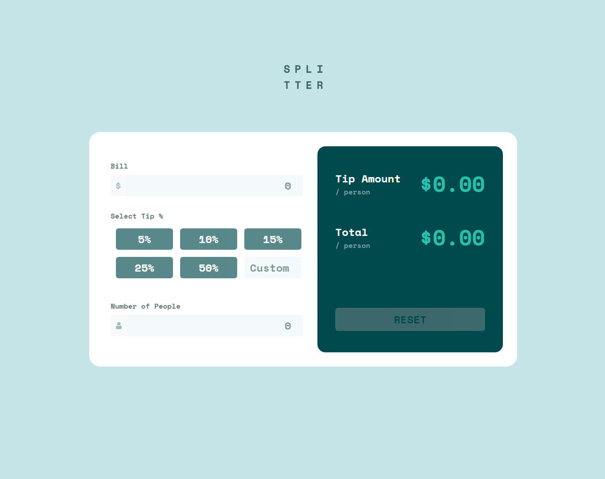
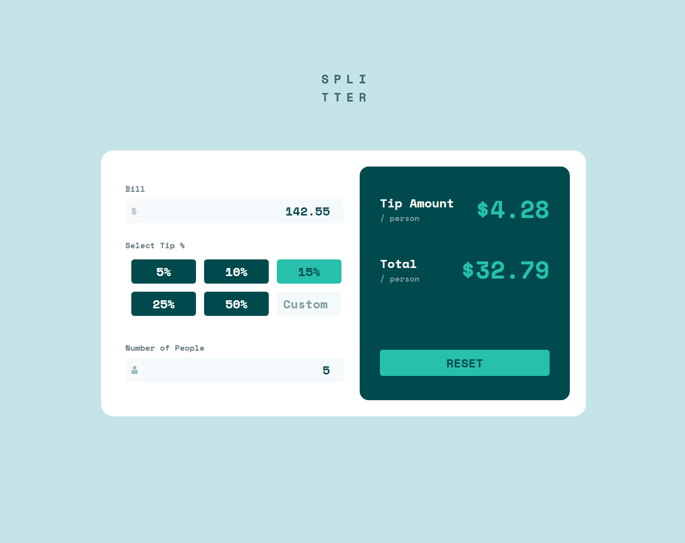
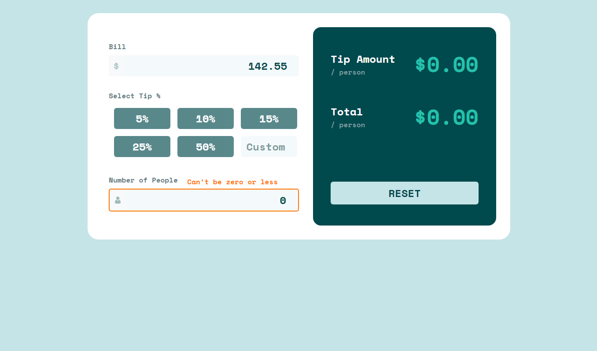
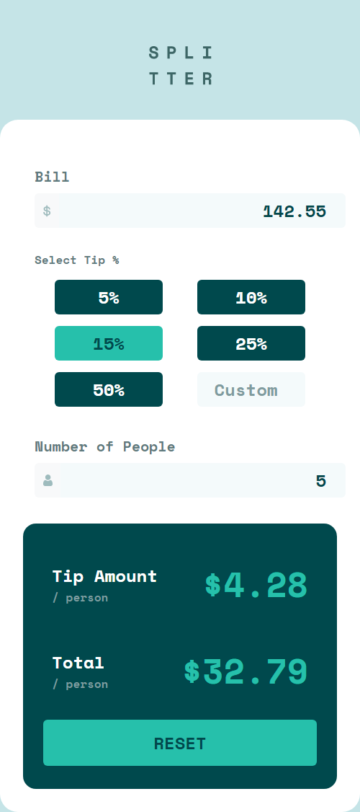

# Frontend Mentor - Tip calculator app solution

This is a solution to the [Tip calculator app challenge on Frontend Mentor](https://www.frontendmentor.io/challenges/tip-calculator-app-ugJNGbJUX). Frontend Mentor challenges help you improve your coding skills by building realistic projects.

## Table of contents

- [Overview](#overview)
  - [The challenge](#the-challenge)
  - [Screenshot](#screenshot)
  - [Links](#links)
- [My process](#my-process)
  - [Built with](#built-with)
  - [What I learned](#what-i-learned)
  - [Continued development](#continued-development)
  - [Useful resources](#useful-resources)
- [Author](#author)

## Overview

### The challenge:

Users should be able to:

- View the optimal layout for the app depending on their device's screen size
- See hover states for all interactive elements on the page
- Calculate the correct tip and total cost of the bill per person

### Screenshots:






### Links:

- Solution URL: [solution URL](https://github.com/DevouraStudio/Tip-Calculator-App)
- Live Site URL: [live site URL](https://devourastudio.github.io/Tip-Calculator-App/)

## My process

### Built with:

- Semantic HTML5 markup
- Flexbox
- CSS3 Grid
- CSS media queries
- Desktop-first workflow
- Javascript (DOM)
- Javascript form validation
- [Bootstrap](https://getbootstrap.com/) - CSS Framework

### What I learned:

<p style="text-align: justify;">
"Well, This Project Was A Highly Challenging And Detailed Undertaking For Me. As It Turns Out, This Was The First Junior-Level Project I Have Ever Completed. Throughout This Project, I Encountered More Issues And Challenges Than Ever Before; However, I Was Fortunately Able To Resolve Them With The Assistance Of Artificial Intelligence (For Which I Am Grateful) And Successfully Finalize The Project.  
In This Project, I Acquired Numerous New Skills Across All Three Areas Of HTML, CSS, And JavaScript, Which Significantly Enhanced My Overall Programming Process.  
From Using Bootstrap Radio Buttons—Which I Had Never Previously Applied In An Official Project—To Working With New Pseudo-Classes Such As “Checked” And “Placeholder,” As Well As Properly Arranging Elements In Both Desktop And Mobile Views, And Addressing JavaScript Challenges Including Form Validation And Animating Calculation Processes.  
Fortunately, Due To The Capabilities Of CSS And Bootstrap, I Did Not Need To Make Extensive Adjustments For The Mobile Version, And This Aspect Progressed Smoothly.  
One Of The Most Frequent Issues I Encountered In This Project Was CSS Specificity, Which—Given The High Level Of Detail Required—Resulted In Conflicts Among The Applied Element Properties.  
One Of My Main Motivations For Choosing This Project Was The Opportunity To Use JavaScript Extensively And Expand My Knowledge As Much As Possible, And I Am Truly Pleased That I Managed To Work With JavaScript Effectively And Confidently."
</p>

```html
<section class="container">
					<div role="group" class="btn-group" id="buttons">
						<div class="container div">
							<input type="radio" class="btn-check" name="options" id="option1" autocomplete="off">
							<label class="btn" for="option1" id="label-1">5%</label>
						</div>
						<div class="container div">
							<input type="radio" class="btn-check" name="options" id="option2" autocomplete="off">
							<label class="btn" for="option2" id="label-2">10%</label>
						</div>
						<div class="container div">
							<input type="radio" class="btn-check" name="options" id="option3" autocomplete="off">
							<label class="btn" for="option3" id="label-3">15%</label>
						</div>
						<div class="container div">
							<input type="radio" class="btn-check" name="options" id="option4" autocomplete="off">
							<label class="btn" for="option4" id="label-4">25%</label>
						</div>
						<div class="container div">
							<input type="radio" class="btn-check" name="options" id="option5" autocomplete="off">
							<label class="btn" for="option5" id="label-5">50%</label>
						</div>
						<div class="container div" id="inputTwoDiv">
							<input type="number" class="form-control" placeholder="Custom" id="inputTwo" min="0">
						</div>
					</div>
```
```css
input.form-control::placeholder {
	color: hsl(184, 14%, 56%);
}

#option1:checked+#label-1 {
	background-color: hsl(172, 67%, 45%);
	color: hsl(183, 100%, 15%);
}
```
```js
inputOne.addEventListener("input", function () {
	if (inputOne.value === "") {
		errorTwo.style.display = "inline"
		error.style.display = 'none'
		inputGroupOne.style.border = "2px rgb(255, 115, 0) solid"
		buttonOne.disabled = true
		buttonTwo.disabled = true
		buttonThree.disabled = true
		buttonFour.disabled = true
		buttonFive.disabled = true
		custom.disabled = true
		reset.disabled = false
	}
	else if (parseFloat(inputOne.value) <= 0) {
		error.style.display = "inline"
		errorTwo.style.display = "none"
		inputGroupOne.style.border = "2px rgb(255, 115, 0) solid"
		buttonOne.disabled = true
		buttonTwo.disabled = true
		buttonThree.disabled = true
		buttonFour.disabled = true
		buttonFive.disabled = true
		custom.disabled = true
		reset.disabled = false
	}
	else {
		if (inputThree.value !== "" && parseFloat(inputThree.value) !== 0) {
			inputGroupOne.style.border = "2px hsl(172, 67%, 45%) solid"
			buttonOne.disabled = false
			buttonTwo.disabled = false
			buttonThree.disabled = false
			buttonFour.disabled = false
			buttonFive.disabled = false
			custom.disabled = false
		}
		error.style.display = "none"
		errorTwo.style.display = "none"
		reset.disabled = false
	}
})

buttonOne.addEventListener("click", function () {
	const tipPerPerson = ((parseFloat(inputOne.value) * 0.05) / parseFloat(inputThree.value))
	const totalPerPerson = (((parseFloat(inputOne.value)) / (parseFloat(inputThree.value))) + parseFloat(tipPerPerson))
	price.textContent = `$${tipPerPerson.toFixed(2)}`
	priceTwo.textContent = `$${totalPerPerson.toFixed(2)}`
})
```

### Continued development:

<p style="text-align: justify;">
Therefore, In Future Work And Upcoming Projects, I Intend To Utilize JavaScript More Extensively, As I Believe It Is A Programming Language With Significant Potential For Managing And Enhancing Web Pages.  
I Will Also Continue Developing My Expertise In Bootstrap And Aim To Incorporate Additional CSS Frameworks—Such As Tailwindcss And Bulma—Into My Future Projects, Given Their Frequent Presence In Programming Job Requirements.  
Furthermore, In Relation To JavaScript, I Plan To Study Its Most Prominent And Widely Used Library, Known As React. By Mastering This Library, I Will Officially Achieve The Status Of A Fully Competent Front-End Developer—A Goal I Have Aspirated To Since Childhood.
</p>

### Useful resources:

- [MDN](https://developer.mozilla.org/en-US/) - "During This Project, I Frequently Referred To The Mozilla Developer Network (MDN) Website As A Trusted Resource For Learning And Clarifying HTML, CSS, and JavaScript. MDN Provided Clear Documentation, Practical Examples, And Best Practices That Helped Me Solve Challenges More Efficiently. Using MDN Not Only Improved My Technical Accuracy But Also Strengthened My Confidence In Applying Modern Web Standards To My Work."

- [Cluade](https://claude.ai/) - "I Want To Be Transparent That I Developed This Project With Assistance From Claude, An Ai Assistant By Anthropic. I Used Claude To Help With Coding, Problem-Solving, And Refining Various Aspects Of The Implementation, While I Directed The Vision, Made The Key Decisions, And Shaped The Final Product. I Believe In Being Upfront About Using Ai Tools In My Workflow—It's Become A Valuable Part Of Modern Development, Allowing Me To Work More Efficiently And Explore Better Solutions. I See This Collaboration Similarly To Using Any Other Development Resource, Where The Skill Is In Effectively Leveraging Tools While Maintaining Understanding And Control Of What's Being Built."

- [Bootstrap](https://getbootstrap.com/) - "In This Project, I Utilized Bootstrap To Streamline the Design Process And Enhance The Visual Appeal Of My Pages. By Leveraging Bootstrap’s Pre-Built Components, Utility Classes, And Customization Options, I Was Able To Maintain Consistent Styling, Organize Content Effectively, and Apply Modern Web Design Techniques More Efficiently. Using Bootstrap Helped Me Focus On Creativity And Attention To Detail While Building The Project."

## Author

- Website - [DevouraStudio](https://www.devoura.ir)
- Frontend Mentor - [@DevouraStudio](https://www.frontendmentor.io/profile/DevouraStudio)
- Github - [@DevouraStudio](https://www.github.com/DevouraStudio)
- Codepen - [@DevouraStudio](https://www.codepen.io/DevouraStudio)
